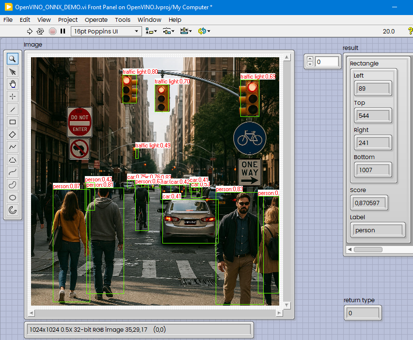

# ssd-mobilenet-labview
How to inference onnx mobile net model in LabVIEW using OpenVINO.

## Tools used:

* LabVIEW 2025 Q1 (64-bit) 25.1.2f2

* Vision Development Module 2025 Q1 

* Visual Studio Professional 2022 17.14.7

* OpenCV 4.11.0

* OpenVINO SDK 2025.2.0

* ONNX ssd-mobilenetv1 Model

### LabVIEW Code (OpenVINO_ONNX_DEMO.vi):


Saved as LabVIEW 2020.

How it works:



### DLL Code behind the scenes:

```c++
#include "LVOpenVINO.h"

#include <cintools/extcode.h>
#include <vision/nivision.h>
#include <openvino/openvino.hpp>
#include <opencv2/opencv.hpp>

const char* COCO_Class[80] = { // COCO class labels
"person", "bicycle", "car", "motorcycle", "airplane", "bus", "train", "truck", "boat", "traffic light",
	"fire hydrant", "stop sign", "parking meter", "bench", "bird", "cat", "dog", "horse", "sheep", "cow",
	"elephant", "bear", "zebra", "giraffe", "backpack", "umbrella", "handbag", "tie", "suitcase", "frisbee",
	"skis", "snowboard", "sports ball", "kite", "baseball bat", "baseball glove", "skateboard", "surfboard",
	"tennis racket", "bottle", "wine glass", "cup", "fork", "knife", "spoon", "bowl", "banana", "apple",
	"sandwich", "orange", "broccoli", "carrot", "hot dog", "pizza", "donut", "cake", "chair", "couch",
	"potted plant", "bed", "dining table", "toilet", "TV", "laptop", "mouse", "remote", "keyboard", "cell phone",
	"microwave", "oven", "toaster", "sink", "refrigerator", "book", "clock", "vase", "scissors", "teddy bear",
	"hair drier", "toothbrush"
};

/* Typedefs */
typedef struct {
	int32_t Left;
	int32_t Top;
	int32_t Right;
	int32_t Bottom;
} TD3;

typedef struct {
	TD3 Rectangle;
	float Score;
	LStrHandle Label;
} TD2; //sizeof == 32

typedef struct {
	int32_t dimSize; // 4 bytes gap
	TD2 Detection[1];
} TD1;
typedef TD1** TD1Hdl;


typedef uintptr_t NIImageHandle;

extern "C" int LV_LVDTToGRImage(NIImageHandle niImageHandle, void* image);
extern "C" int LV_SetThreadCore(int NumThreads);

LVOPENVINO_API int fnLVmobileOpenVINO( NIImageHandle LVSrcImage, const char* lv_model, float lv_score, TD1Hdl Detections)
{
	try {
		Image* ImgSrc;
		uint8_t* LVImagePtrSrc;
		int LVWidth, LVHeight;

		LV_SetThreadCore(1); //must be called prior to LV_LVDTToGRImage
		LV_LVDTToGRImage(LVSrcImage, &ImgSrc);
		imaqGetImageSize(ImgSrc, &LVWidth, &LVHeight);
		int LVLineWidthSrc = ((ImageInfo*)ImgSrc)->pixelsPerLine;
		LVImagePtrSrc = (uint8_t*)((ImageInfo*)ImgSrc)->imageStart;

		// Convert stride from pixels to bytes (4 bytes per pixel for RGBA)
		int strideBytes = LVLineWidthSrc * 4;
		// Create cv::Mat using the stride-aware constructor
		cv::Mat image_test(LVHeight, LVWidth, CV_8UC4, LVImagePtrSrc, strideBytes);

		cv::Mat image;
		cv::cvtColor(image_test, image, cv::COLOR_RGBA2RGB);

		// Expand dimensions to match model input
		ov::Shape input_shape = {
			static_cast<size_t>(1),
			static_cast<size_t>(image.rows),
			static_cast<size_t>(image.cols),
			static_cast<size_t>(3)
		};

		cv::Mat input_blob;
		image.convertTo(input_blob, CV_8U);
	
		// Initialize OpenVINO
		ov::Core core;

		std::shared_ptr<ov::Model> model = core.read_model(lv_model); //wrong path ->  exception
		ov::CompiledModel compiled_model = core.compile_model(model, "CPU");
		ov::InferRequest infer_request = compiled_model.create_infer_request();

		// Prepare input tensor
		ov::Tensor input_tensor = ov::Tensor(ov::element::u8, input_shape, input_blob.data);
		infer_request.set_input_tensor(input_tensor);

		// Run inference
		infer_request.infer();

		// Get output tensors
		auto output0 = infer_request.get_output_tensor(0); // boxes
		auto output1 = infer_request.get_output_tensor(1); // scores
		auto output2 = infer_request.get_output_tensor(2); // classes

		const float* boxes = output0.data<const float>();
		const float* classes = output1.data<const float>(); //swapped with scores?
		const float* scores = output2.data<const float>();

		const int num_detections = (int)(output1.get_shape()[1]);

		int* filtered_indices = new int[num_detections];

		int num_filtered = 0;
		int num_classes = sizeof(COCO_Class) / sizeof(COCO_Class[0]);
	
		for (int i = 0; i < num_detections; ++i) {
			float score = scores[i];
			if ((score > lv_score )) { // Threshold for filtering
				int class_id = static_cast<int>(classes[i]) - 1;
				if (class_id < 0 || class_id >= num_classes) continue;
				filtered_indices[num_filtered++] = i;
			}
		}

		// Resize the array to hold num_filtered elements
		MgErr err = DSSetHandleSize(Detections, sizeof(int32_t) + 4 + sizeof(TD2) * num_filtered); // 4 bytes alignment gap
		if (err != noErr) return -1;
		(*Detections)->dimSize = num_filtered;

		for (int i = 0; i < num_filtered; ++i) {
			int index = filtered_indices[i];
			// Fill rectangle with values
			(*Detections)->Detection[i].Rectangle.Left = (int32_t)(boxes[index * 4 + 1] * image.cols);
			(*Detections)->Detection[i].Rectangle.Top = (int32_t)(boxes[index * 4 + 0] * image.rows);
			(*Detections)->Detection[i].Rectangle.Right = (int32_t)(boxes[index * 4 + 3] * image.cols);
			(*Detections)->Detection[i].Rectangle.Bottom = (int32_t)(boxes[index * 4 + 2] * image.rows);

			// Score
			(*Detections)->Detection[i].Score = scores[index]; // Use the actual score from the model

			int class_id = static_cast<int>(classes[index]) - 1;
			size_t len = strlen(COCO_Class[class_id]);
			(*Detections)->Detection[i].Label = (LStrHandle)DSNewHandle((int32_t)len + sizeof(int32));
			if (err != noErr) return -1;

			LStrHandle LVlabel = (*Detections)->Detection[i].Label;
			(*LVlabel)->cnt = (int32_t)len;
			MoveBlock(COCO_Class[class_id], (*LVlabel)->str, len); // Use MoveBlock to copy the string
		}
		return 0;
	}
	catch (const std::exception&) {
		// Log or handle error if needed
		return -2;
	}
}
```

